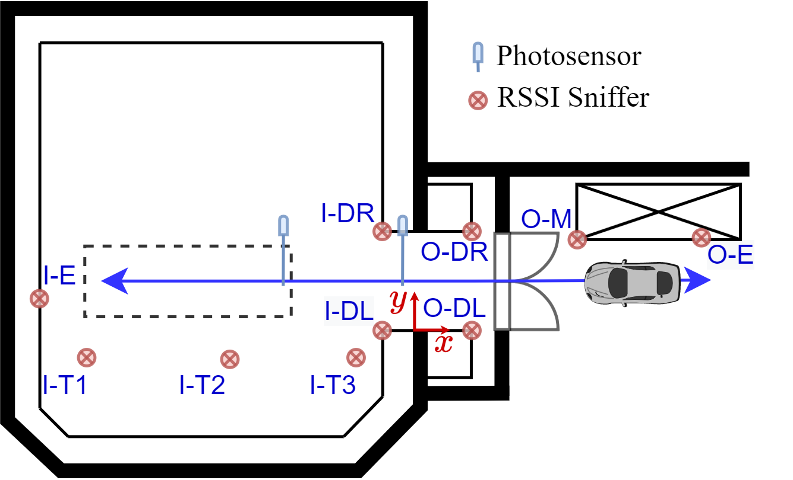
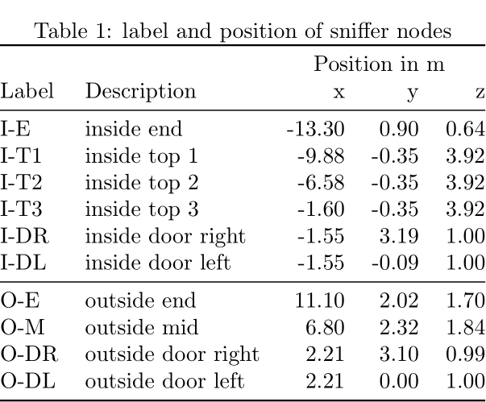
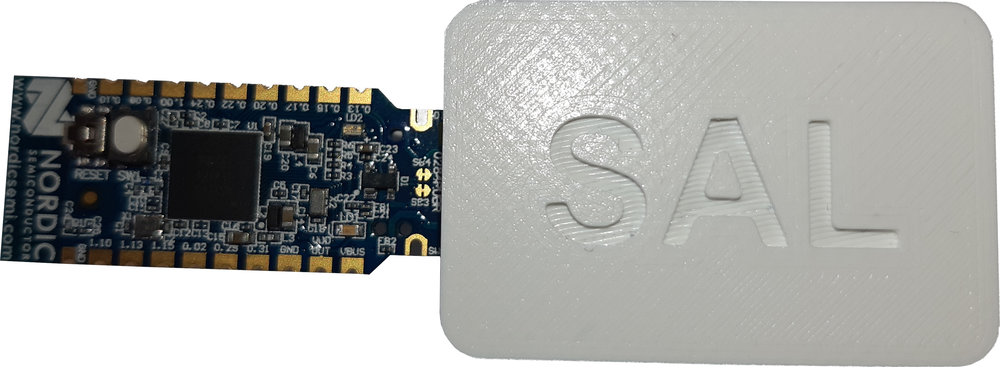

# SAL-Autarkic-Localization-RSSI-BLE-Dataset

The SAL-Autarkic-Localization-RSSI-BLE-Dataset (SAL-RB-Dataset) is a set of more than 20 000 labeled Received Signal Strength Indicator (RSSI) measurements for indoor localization with Bluetooth Low Energy (BLE). The individual measurement sets are measured in a 100 ms interval. All measurements in this work were obtained at AVL List GmbH in Graz, Austria, who kindly provided us their automotive testbed.

The idea is that the position of one sensor node, referred to as measurement-node (MN) should be estimated based on RSSI measurements collected with sniffer-nodes (SN). These SNs have no direct interaction with the MN, they just measure the RSSI values of the messages from the MN sent to the base station.

# Measurement Campaign
## Measurement Setup

Ten BLE SNs are places inside and outside the testbed and collect the RSSI values of the messages sent from the MN to the base station. The measurements are sent in a 100 ms interval, hence, the interval of the RSSI measurements is the same. Additionally,  two  photosensors are placed  at  the  doorstep  and  the  car  test-position respectively, to automatically label the measurement sets.  The complete measurement setup is depicted in the following.

The description and coordinates of the SNs can be found in `measurement_config.txt` and is also depicted in the following:

## Hardware and Protocol
For the implementation of the physical layer (PHY), BLE is used to set up a network with the time division multiple access (TDMA) protocol EPhESOS [[1]](#1). The length of one superframe is 100 ms. As BLE hardware the Nordic NRF52840 dongles were used.

<a id="1">[1]</a>  H. Bernhard, A. Springer, A. Berger, and P. Priller, “Life cycle of wireless sensor nodes in industrial environments,” in 2017 IEEE 13th International Workshop on Factory Communication Systems (WFCS), 2017, pp. 1–9.

## Dataset

The complete SAL-RB-Dataset consists of more than 20 000 labeled RSSI measurements for each SN. Two different scenarios are covered:
- two disjoint measurement-sets where a person is walking inside and outside the measurement chamber
- eight disjoint measurement-sets where a car drives inside and outside. Here two different MN were used

A missing link is denoted with a RSSI value of -100 dBm.

The RSSI values are labeled with the photosensor as follows:
- Label = 0 : car is outside the testbed
- Label = 1 : car is completely inside the testbed
- Label = 2 : car is inside the testbed and on measurement position

If different labeling of the RSSI measurements is needed, the SAL-RB-Dataset additionally provides the raw photosensor data.

The individual measurement-sets are named as  `TYPE_sensor_X_measurement_Y.csv`, where TYPE indicates either a car or walk scenario, X defines the used MN, and X is the measurement number.

# Related publications

# License 
This dataset is distributed under the [Creative Commons Attributions License 4.0 (CC-BY 4.0)](https://creativecommons.org/licenses/by/4.0/).
